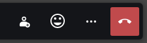

When your video is disabled react by temporarily changing your avatar to an emoji.

## Installation

Drag the following link into your browser's bookmark bar: [Emoji reaction](javascript:(function()%7Bfunction%20callback()%7B%7Dvar%20s%3Ddocument.createElement(%22script%22)%3Bs.src%3D%22https%3A%2F%2Fjitsi-hacks.cketti.eu%2Femoji-reaction.js%22%3Bif(s.addEventListener)%7Bs.addEventListener(%22load%22%2Ccallback%2Cfalse)%7Delse%20if(s.readyState)%7Bs.onreadystatechange%3Dcallback%7Ddocument.body.appendChild(s)%3B%7D)()){: .bookmarklet}

To inject the script click the link in the bookmark bar while the Jitsi Meet tab is active. The effects only last until
the next page reload.

## Usage

Once the hack is loaded a new "smiley" button will be visible in the toolbar.

Press that button to activate the functionality.

In the dialog that appears select one of the emojis. Your avatar will be changed to the selected emoji image for 30
seconds and then switch back to the previous avatar.

## How does it work?

The script uses Jitsi's functionality to change the avatar URL. It remembers the previous avatar URL and switches back
to it after 30 seconds.

## Source Code

Find [emoji-reaction.js](https://github.com/cketti/jitsi-hacks/blob/main/docs/emoji-reaction.js) on GitHub.
