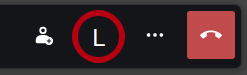

Include a text overlay in your video stream. See [lower third](https://en.wikipedia.org/wiki/Lower_third) on Wikipedia.

Photo on the right video tile by [Zachary Kadolph](https://unsplash.com/@zacharykadolph) on [Unsplash](https://unsplash.com/photos/xdGELZzh2Pw)
{: .image-credits}

## Installation

Drag the following link into your browser's bookmark bar: [Lower Third](javascript:(function()%7Bfunction%20callback()%7B%7Dvar%20s%3Ddocument.createElement(%22script%22)%3Bs.src%3D%22https%3A%2F%2Fjitsi-hacks.cketti.eu%2Flower-third.js%22%3Bif(s.addEventListener)%7Bs.addEventListener(%22load%22%2Ccallback%2Cfalse)%7Delse%20if(s.readyState)%7Bs.onreadystatechange%3Dcallback%7Ddocument.body.appendChild(s)%3B%7D)()){: .bookmarklet}

To inject the script click the link in the bookmark bar while the Jitsi Meet tab is active. The effects only last until
the next page reload.

## Usage

Once the hack is loaded a new 'L' button will be visible in the toolbar.

Press that button to activate the functionality.

In the dialog that appears enter the text to be displayed and press "Enable". If your video is currently active it will now display
the entered text at the bottom. If not, the text will show the next time you turn on the camera. Press the 'L' button
again to disable the lower third.

#### Mirrored video

In many Jitsi installations the local video is mirrored by default. In that case the text displayed to you will be
mirrored as well. You can change how the video is displayed to you by right-clicking your video tile and selecting "Flip".

## Limitations

- The lower third feature can't be used together with Jitsi's "Blur my background" feature. That's because both are
using Jitsi Meet's built-in 'effect' mechanism (see "[How does it work?](#how-does-it-work)" below). And there can only be one effect active at a time.
- For the same reason this feature doesn't work when sharing the screen and overlaying the camera video on top of the screen.

## How does it work?

[`lib-jitsi-meet`](https://github.com/jitsi/lib-jitsi-meet) has an [API](https://github.com/jitsi/lib-jitsi-meet/blob/33307629947bf32055f2cbc1798add0871c9ec1e/doc/API.md)
that allows adding an 'effect' to the video stream. The "blur my background" feature for example is implemented as an effect.
See [JitsiStreamBlurEffect.js](https://github.com/jitsi/jitsi-meet/blob/997c3f75b582baa7130315a80f242b010bf94d6d/react/features/stream-effects/blur/JitsiStreamBlurEffect.js).

When enabling an effect the `startEffect()` function gets the current `MediaStream` as input and needs to return a
`MediaStream` instance as output. This hack uses the same approach as the "blur my background" implementation. The
original video is drawn onto a [`<canvas>`](https://developer.mozilla.org/en-US/docs/Web/API/Canvas_API) and then the
 lower third is drawn on top. The contents of this canvas are
 [captured](https://developer.mozilla.org/en-US/docs/Web/API/HTMLCanvasElement/captureStream) as a video stream and
 that is what is returned by our `startEffect()` function.

## Source Code

Find [lower-third.js](https://github.com/cketti/jitsi-hacks/blob/main/docs/lower-third.js) on GitHub.
