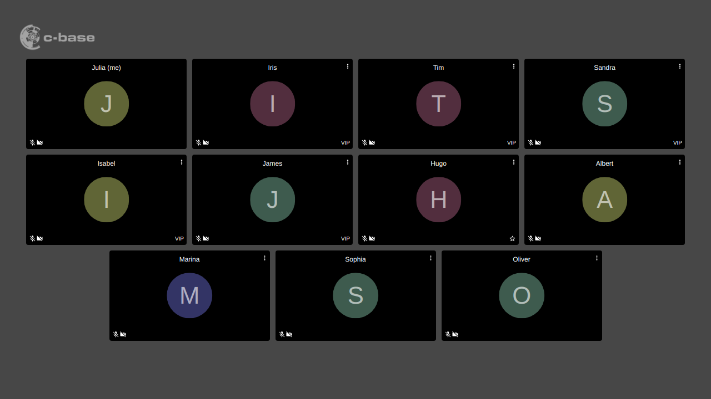
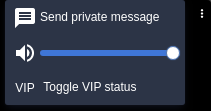

For meetings where you need to keep track of certain participants.

Mark participants as VIPs and have their video tiles sorted to the front.

## Installation

Drag the following link into your browser's bookmark bar: [VIP](javascript:(function()%7Bfunction%20callback()%7B%7Dvar%20s%3Ddocument.createElement(%22script%22)%3Bs.src%3D%22https%3A%2F%2Fjitsi-hacks.cketti.eu%2Fvip.js%22%3Bif(s.addEventListener)%7Bs.addEventListener(%22load%22%2Ccallback%2Cfalse)%7Delse%20if(s.readyState)%7Bs.onreadystatechange%3Dcallback%7Ddocument.body.appendChild(s)%3B%7D)()){: .bookmarklet}

To inject the script click the link in the bookmark bar while the Jitsi Meet tab is active. The effects only last until
the next page reload.

## Usage

Once the hack is loaded your video will be reordered to the top (upper left). You can mark other participants as VIP
by selecting "Toggle VIP status" in the popup on their video tile. VIPs will be reordered to the top as well.

The display names of VIPs are saved to the browser's local storage. Participants with those names will be marked as VIP
automatically the next time the hack is loaded.

## Limitations

This script currently doesn't work together with the [reorder video tiles](/hacks/reorder/) hack.

## Source Code

Find [vip.js](https://github.com/cketti/jitsi-hacks/blob/main/docs/vip.js) on GitHub.
