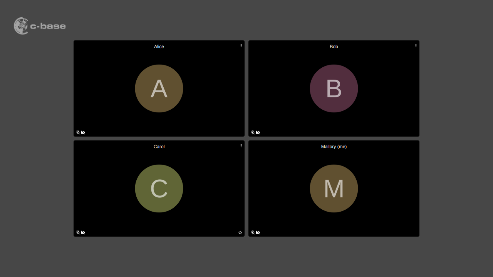

Always show the participants' names, not only when the mouse is moved over a video tile.

## Installation

Drag the following link into your browser's bookmark bar: [Always show names](javascript:(function()%7Blet%20link%20%3D%20document.createElement('link')%3Blink.rel%20%3D%20'stylesheet'%3Blink.type%20%3D%20'text%2Fcss'%3Blink.href%20%3D%20'https%3A%2F%2Fjitsi-hacks.cketti.eu%2Falways-show-display-names.css'%3Bdocument.head.appendChild(link)%7D)()){: .bookmarklet}

To inject the hack click the link in the bookmark bar while the Jitsi Meet tab is active. The effects only last until
the next page reload.

## How does it work?

The bookmarklet injects a CSS file containing a few rules to achieve the desired effect.

## Source Code

Find [always-show-display-names.css](https://github.com/cketti/jitsi-hacks/blob/main/docs/always-show-display-names.css) on GitHub.
