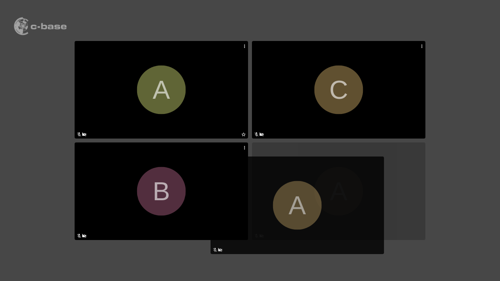

Reorder video tiles via drag and drop.

## Installation

Drag the following link into your browser's bookmark bar: [Reorder video tiles](javascript:(function()%7Bfunction%20callback()%7B%7Dvar%20s%3Ddocument.createElement(%22script%22)%3Bs.src%3D%22https%3A%2F%2Fjitsi-hacks.cketti.eu%2Freorder.js%22%3Bif(s.addEventListener)%7Bs.addEventListener(%22load%22%2Ccallback%2Cfalse)%7Delse%20if(s.readyState)%7Bs.onreadystatechange%3Dcallback%7Ddocument.body.appendChild(s)%3B%7D)()){: .bookmarklet}

To inject the script click the link in the bookmark bar while the Jitsi Meet tab is active. The effects only last until
the next page reload.

## Usage

Once the hack is loaded you can reorder videos in tile view via drag and drop.

## How does it work?

The script utilizes the [Dragula](https://bevacqua.github.io/dragula/) library to allow reordering video tiles via
drag and drop.

## Source Code

Find [reorder.js](https://github.com/cketti/jitsi-hacks/blob/main/docs/reorder.js) on GitHub.
